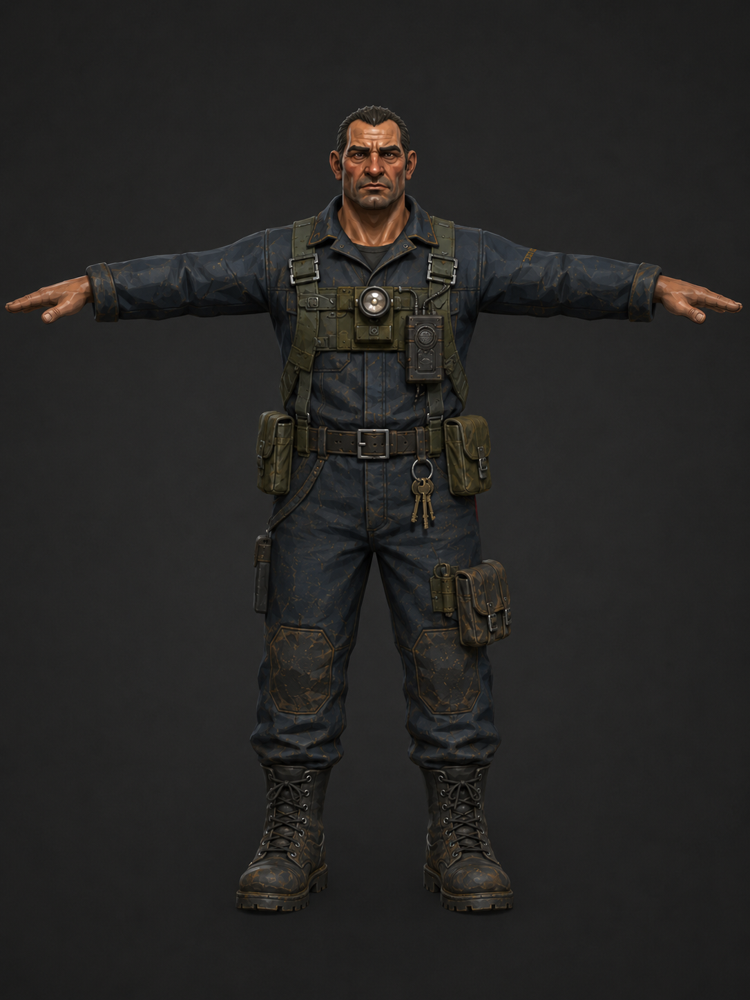
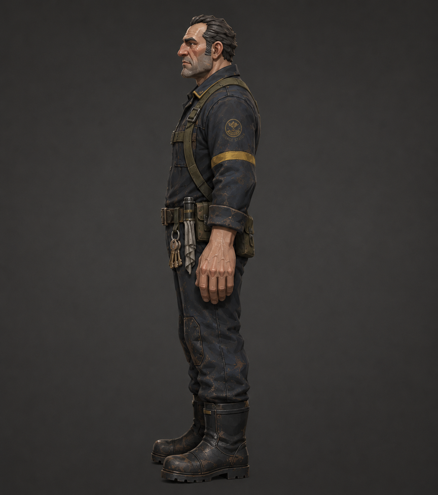
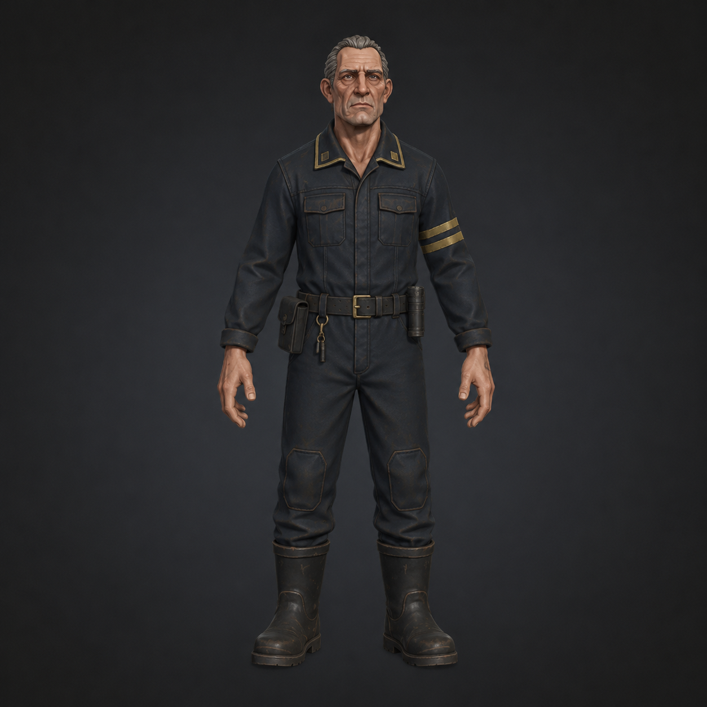
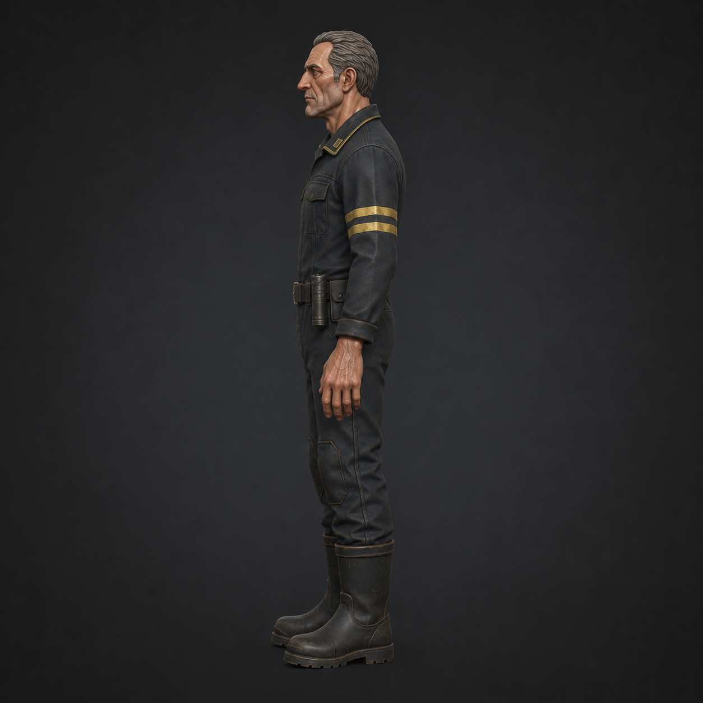
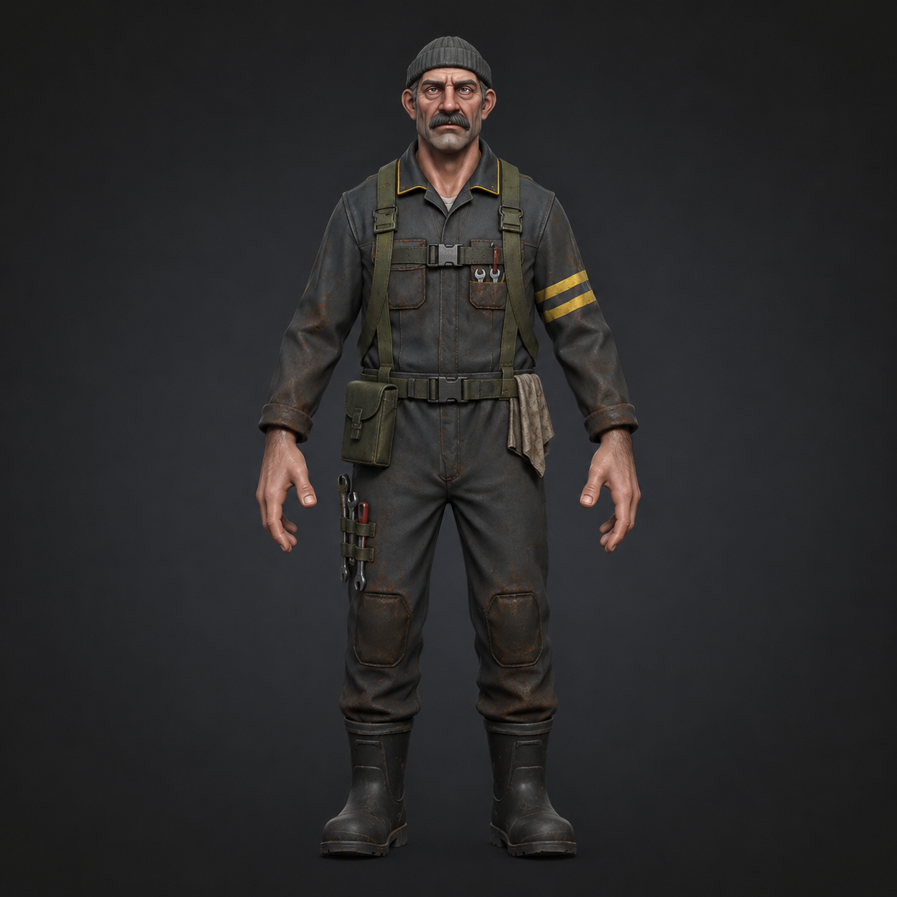
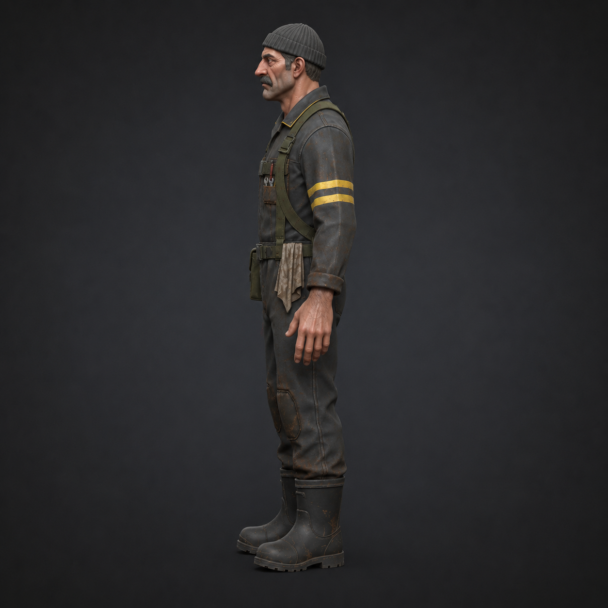
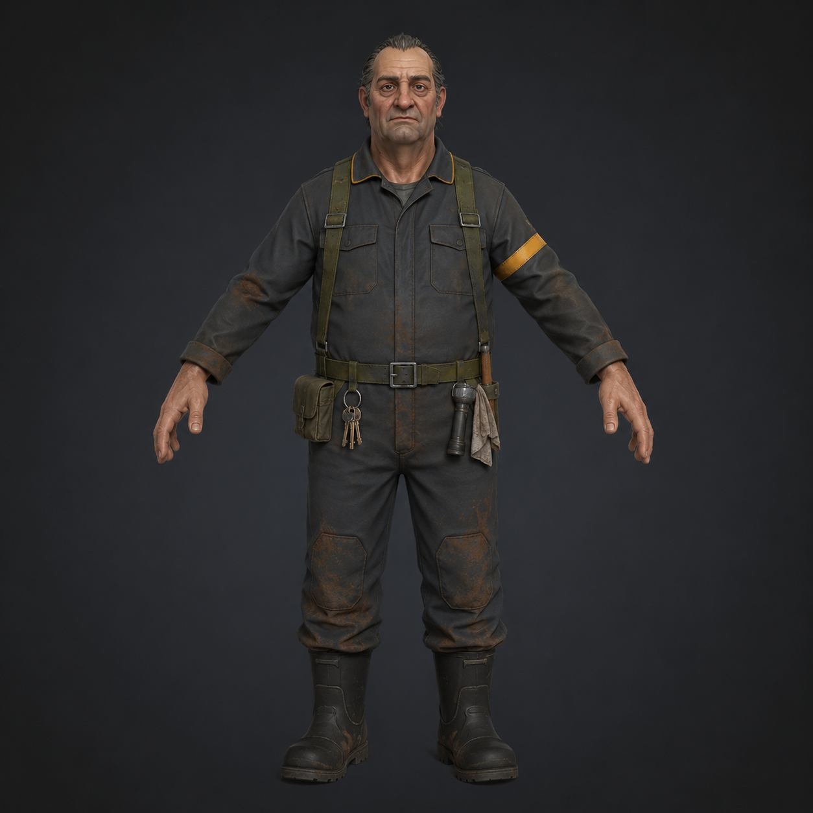
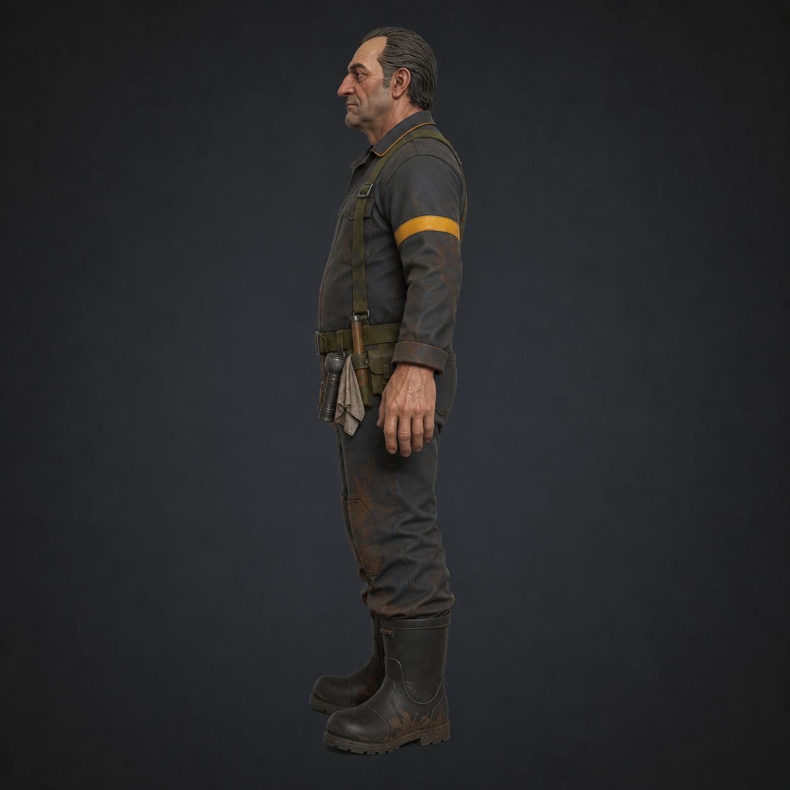

# Crew Notes

Notes centralisées sur les personnages de l'équipage Sub3D. Source : références visuelles + descriptions fournies par l'utilisateur.

---

## Direction Artistique

**Style cible** : croisement entre **Deep Rock Galactic** (silhouette lisible, palette industrielle) et **Team Fortress 2** (gamification proportions, lecture instantanée du rôle).

**Contraintes solo dev** :

- Stylized / low-poly, **pas** de high-poly sculpt detail
- Hand-painted feel + PBR léger (pas de photo-scan)
- Textures simples / hand-crafted
- Géométrie modérée — silhouette compte plus que la densité

**Proportions gamifiées** :

- Tête légèrement plus grande que réaliste (~1:7 vs 1:7.5)
- Mains visiblement larges (lecture FPS + gameplay items)
- Pas cartoon non plus — on reste dans le crédible

**Contrainte critique — base nue uniquement** :

- Ceintures, poches, pouches doivent être **vides** sur le mesh Meshy
- **Pas d'outils**, pas de chiffon, pas de clés, pas de lampe modélisés sur le perso
- Tout l'équipement = modulaire dans Unreal (static mesh attachés via sockets)
- **Pas de chapeau, pas de bonnet, pas d'armes** sur le mesh

---

## Référence de style — Captain front

`captain_front.png` est le benchmark visuel pour les 3 personnages. Toute génération future doit converger vers ce niveau de style.

**Proportions** :

- Hauteur de tête ≈ 1/7e du corps (gamifié léger)
- Mains larges, doigts épais
- Épaules carrées sans exagération
- Cou épais et solide

**Visage / tête** :

- Tête allongée verticalement, front haut
- Mâchoire prononcée mais pas carrée
- Yeux enfoncés, regard direct, paupières marquées par l'âge
- Sourcils prononcés gris
- Nez droit
- Bouche fine, expression ferme
- Cheveux gris cendré uniformes coiffés en arrière, courts (3-5 cm)
- Pas de barbe, peau lisse avec léger grain
- Rides : sillons nasogéniens, front, coins des yeux

**Texture / matériaux** :

- PBR léger avec roughness différencié : tissu mat (~0.85), cuir semi-mat (~0.55), peau (~0.78), métal boutons (~0.30)
- Hand-painted feel sur le tissu : variations subtiles de teinte sans bruit photographique
- Pas de pores hyperréalistes, pas de cheveux individuels, pas de fibres apparentes
- Edges légèrement adoucies (pas hard-edge low-poly cartoon)

**Wear pattern** :

- Légères usures aux coudes et plis
- Métal patiné (ni neuf ni rouillé)
- Cuir mat profond
- Peau tannée subtilement, age spots discrets

**Palette validée sur Captain** :

- Navy combinaison `#1A2238`
- Galons dorés / passepoil col `#B8732C`
- Cuir bottes / pantalon `#1A1C1E`
- Peau tannée mid-tone

---

## Crew (générique)

**Description** : ouvrier de base, **25 ans**, build sportif athlétique, cheveux courts bruns, rasé, visage frais et alerte. Combinaison charcoal `#3A3D40` avec passepoil col jaune `#C9A646`. Ceinture sangle olive vide. Genouillères octogonales. Bottes caoutchouc montantes. Mains nues. Aucun accessoire. Sert de base réutilisable pour les rôles secondaires.

---

## Captain

**Description** : commandant, 55-60 ans, traits anguleux, mâchoire prononcée, gris cendré coiffé arrière, rasé. Combinaison une-pièce navy `#1A2238`, col droit relevé bordé doré `#B8732C` avec petits insignes col rectangulaires (symétriques bilatéraux). 2 poches plaquées poitrine vides. Ceinture cuir noir avec boucle laiton. Genouillères octogonales cuir foncé. Bottes cuir mi-mollet. Posture droite, autorité posée.

---

## Engineer / Mécano

**Description** : mécanicien, 45-50 ans, build compact musclé, mâchoire forte, **moustache noire épaisse** distinctive, cheveux noirs courts, regard sombre. Combinaison charcoal `#3A3D40` avec passepoil col jaune `#C9A646`, 2 poches poitrine vides. Ceinture sangle olive vide. Genouillères octogonales. Bottes caoutchouc montantes. Tannage prononcé du visage (travail moteur). Aucun outil/bonnet/harnais — tout va en modulaire Unreal.

---

## Concierge / Artisan

**Description** : factotum/artisan, 50-55 ans, build solide standard, **gris poivre-sel coiffé arrière sans gel**, rasé, visage long aux joues marquées, regard fatigué mais alerte. Combinaison charcoal `#3A3D40` (identique Crew) avec passepoil col jaune `#C9A646`, 2 poches poitrine vides. Ceinture sangle olive vide. Genouillères octogonales. Bottes caoutchouc montantes. Différencié du Crew par les cheveux plus marqués et l'âge.
