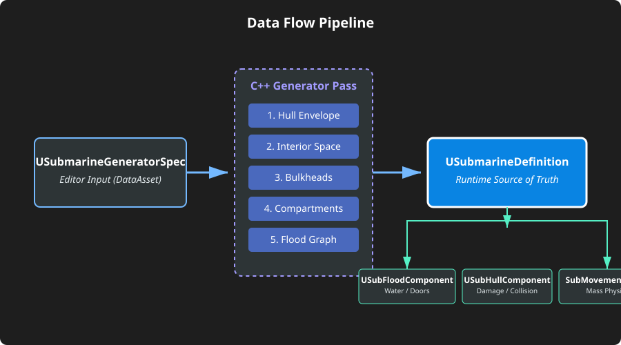
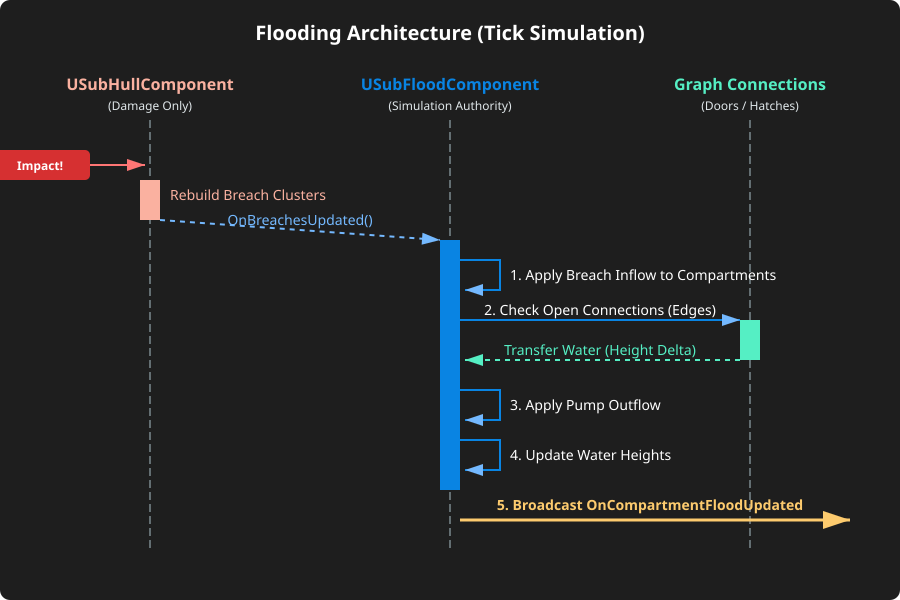
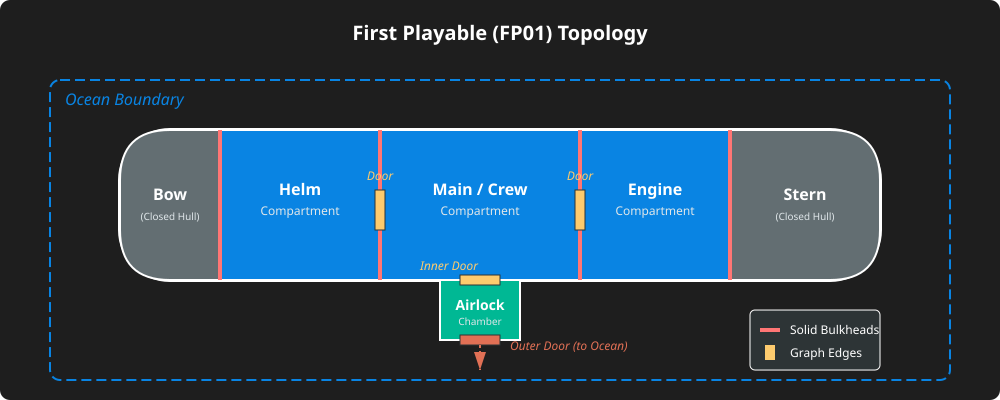

# Sub3D - Architecture Diagrams

Ces diagrammes illustrent les concepts clés du plan d'architecture unifié généré pour le First Playable (FP01) du générateur de sous-marin.

## 1. Pipeline de Données (La Vérité Unique)

Ce diagramme montre comment l'intention du designer est transformée en une définition unique au runtime, qui est ensuite consommée par tous les systèmes.

## 2. Architecture du Flooding (SubFloodComponent)

Ce diagramme illustre le flux de simulation d'eau à chaque tick dans l'architecture cible, et la séparation avec le `SubHullComponent`.

## 3. Topologie du Submarine First Playable (FP01)

Ce diagramme représente la structure attendue du premier sous-marin jouable généré, avec ses compartiments dérivés des cloisons (bulkheads) et son sas (airlock).

