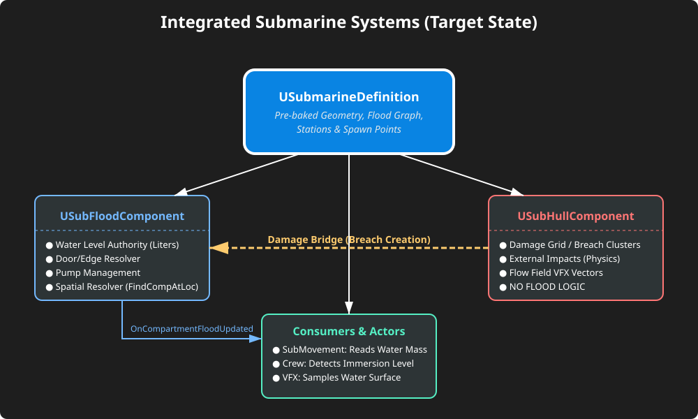
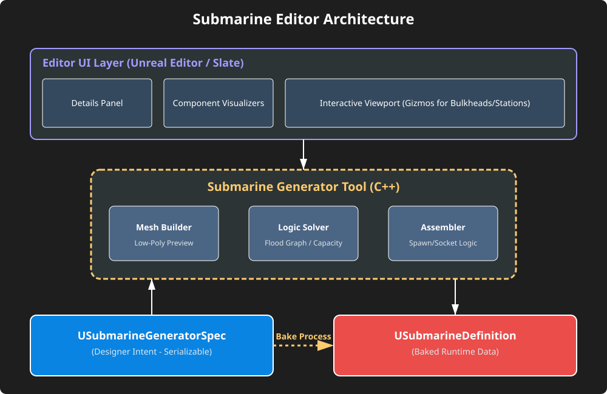
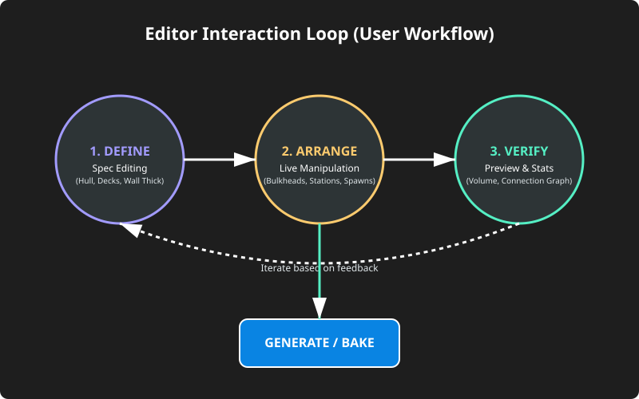

# Sub3D - Future State Specification: Submarine Generator & Editor

Ce document définit l'état cible du projet après la finalisation complète des phases d'implémentation (incluant Phase 5C - Wiring et Corrections). Il sert de guide pour la cohérence des systèmes et le développement de l'outillage éditeur.

---

## 1. État des Systèmes Intégrés (Post-Wiring)

Une fois le câblage terminé, la vérité ne réside plus dans les acteurs placés à la main, mais dans l'**USubmarineDefinition** générée.

### Correspondances clés :
*   **Autorité de l'eau** : `USubFloodComponent` est le seul maître du niveau d'eau. Il résout la spatialité (dans quel compartiment est cette brèche ?) et la topologie (l'eau peut-elle passer par cette porte ?).
*   **Séparation des dommages** : `USubHullComponent` est réduit à une grille physique de dommages. Il ne connaît pas "l'eau", il ne connaît que les "trous". Il pousse ses clusters de brèches vers le Flood via un pont de délégués.
*   **Consommation unifiée** : Les Character (Crew), les Physics (Movement) et les Visuals (VFX) ne lisent plus jamais `SubHull`. Ils s'abonnent à `USubFloodComponent` pour réagir au volume d'eau.

---

## 2. Guide de Conception de l'Éditeur

L'objectif de l'éditeur est de permettre aux designers de manipuler la `USubmarineGeneratorSpec` visuellement sans manipuler directement des fichiers C++ ou des DataAssets bruts.

### Architecture de l'Outil

#### Comment "faire" cet éditeur dans Unreal Engine :
1.  **Component Visualizers** : Utiliser la classe `FComponentVisualizer` pour dessiner des widgets 3D dans le viewport (ex: lignes pour les bulkheads, icônes pour les stations).
2.  **Interactive Gizmos** : Permettre de cliquer et faire glisser les cloisons (bulkheads) sur l'axe X. Chaque mouvement met à jour le tableau `BulkheadPositionsNormalized` dans la `Spec`.
3.  **Live Preview** : Attacher un listener sur `PostEditChangeProperty`. Dès qu'une valeur change dans la Spec, lancer une génération "légère" (sans collision complexe) pour mettre à jour les meshes de preview dans le viewport.
4.  **Bake Button** : Un bouton explicite pour générer la version "Production" de la `USubmarineDefinition` (calcul des volumes réels par intégrale, génération des collisions convexes, baking du Flood Graph).

### Workflow Utilisateur

1.  **DEFINE** : Réglage des paramètres de base (longueur, profil de coque, nombre de ponts) via le panneau Détails.
2.  **ARRANGE** : Positionnement spatial des compartiments et des stations. L'éditeur doit empêcher le placement d'une station hors des limites valides calculées par le Mesh Builder.
3.  **VERIFY** : Inspection en temps réel du graph de flooding. S'assurer qu'aucune pièce n'est isolée par erreur.
4.  **GENERATE** : Sortie d'un Asset immuable utilisé par le runtime.

---

## 3. Recommandations Techniques Finales

*   **Runtime Immuable** : La `USubmarineDefinition` ne doit jamais être modifiée en jeu. Si on veut modifier le sous-marin (ex: destruction de paroi), on modifie l'état dynamique dans `USubFloodComponent` (activation d'un edge "Open" là où c'était "Sealed").
*   **Debug & Observabilité** : L'éditeur doit inclure un mode "Flood Debug" permettant de simuler une montée d'eau visuelle directement dans le viewport pour valider les pentes et les capacités de drainage avant de lancer le jeu.
