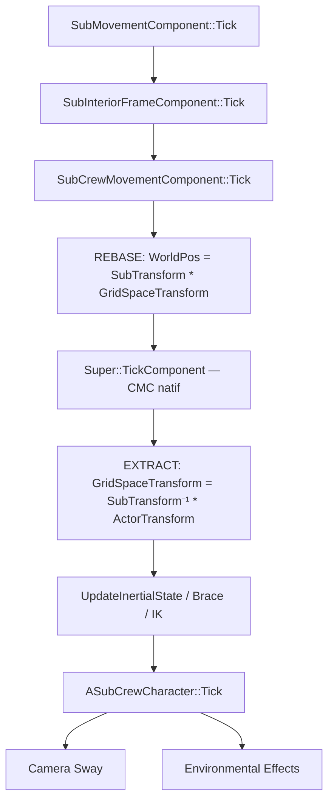

# Architecture : Local Grid Space Authority pour Sub3D

**Date** : 2026-04-21
**Statut** : Validé — prêt pour implémentation
**Contexte** : Remplacement de l'approche "world-space + MovementBase compensation" par une autorité locale du sous-marin sur le mouvement du joueur.
**Validation** : Décisions Q1, Q2, Q3 tranchées le 2026-04-21. Corrections techniques intégrées.

---

## 1. Le Problème Fondamental (Résumé)

Le CMC d'Unreal Engine calcule tout en World Space. Quand le personnage est sur un `MovementBase` (le pont du sous-marin), le moteur applique `UpdateBasedMovement` pour suivre le déplacement de la base. Mais :

- **Perte de base** : Dès que le joueur quitte une surface (transition escalier, pas entre deux meshes, micro-chute), le CMC passe en `Falling`, perd le `MovementBase`, et le joueur cesse d'être transporté par le sous-marin → il tape le mur arrière.
- **Changement de base** : Passer d'un `WalkableComponent` à un autre déclenche des recalculs de vélocité et d'inertie qui créent des micro-stutters.
- **Compensation a posteriori** : Toute la compensation actuelle (`ApplyYawCompensation`, `Tether`, `FloorRecovery`) arrive **après** que le dommage est fait, une frame trop tard.

La solution : **Ne plus dépendre du MovementBase pour le suivi du sous-marin.**

---

## 2. Le Principe : Rebased Movement

Chaque frame, le cycle est :

```
1. SubMovement tick       → Le sous-marin avance dans le monde
2. InteriorFrame tick     → Le delta frame est calculé
3. CrewMovement tick :
   a. REBASE : Téléporter le character à SubNewTransform * StoredLocalPos
   b. SIMULATE : Laisser le CMC faire son travail normal (sweeps, gravité, floor)
   c. EXTRACT : StoredLocalPos = SubNewTransform⁻¹ * ActorWorldPos
```

### Pourquoi ça marche

- **Étape (a)** : Avant que le CMC ne calcule quoi que ce soit, le personnage est **déjà** à sa bonne position dans le monde par rapport au sous-marin. Le CMC n'a rien à compenser.
- **Étape (b)** : Le CMC fait ses sweeps en World Space contre la géométrie réelle du sous-marin (qui est aussi dans le monde). Collisions, gravité, `FindFloor`, `StepUp` — tout fonctionne nativement. Le CMC croit que le personnage se déplace dans un décor statique normal.
- **Étape (c)** : On extrait la nouvelle position locale. C'est cette position qui fait autorité. Si le sous-marin tourne entre cette frame et la suivante, le rebase (a) de la frame suivante replace automatiquement le joueur au bon endroit.

> [!IMPORTANT]
> Le `MovementBase` n'est plus utilisé pour le transport du joueur. Le CMC peut toujours détecter un floor et setter un `MovementBase` en interne (pour `IsWalkable`, `FindFloor`, etc.), mais **le transport est fait par le rebase**, pas par `UpdateBasedMovement`.

---

## 3. La Formule

```
WorldPresentationTransform = SubWorldTransform * PlayerLocalTransform
```

À chaque frame :
```cpp
// REBASE (avant CMC)
FTransform DesiredWorld = SubTransform * StoredLocalTransform;
UpdatedComponent->SetWorldLocationAndRotation(
    DesiredWorld.GetLocation(), DesiredWorld.GetRotation(),
    /* bSweep */ false, nullptr, ETeleportType::TeleportPhysics);

// ... CMC tick normal (sweeps, gravity, floor) ...

// EXTRACT (après CMC)
StoredLocalTransform = SubTransform.Inverse() * Character->GetActorTransform();
```

> [!WARNING]
> Ne pas utiliser `SetActorLocation` / `SetActorTransform`. Ces fonctions déclenchent une mise à jour des overlaps et des events de mouvement à chaque frame. `UpdatedComponent->SetWorldLocationAndRotation` avec `bSweep=false` et `ETeleportType::TeleportPhysics` bypass ces calculs inutiles avant le vrai tick CMC.

---

## 4. Changements Concrets dans le Code Existant

### 4.A — `USubCrewMovementComponent` (Override principal)

#### Nouvelles données membres

```cpp
// Position et rotation locale relative au Root du submarine.
// C'est la vérité autoritaire quand bIsGridSpaceAuthority == true.
UPROPERTY(BlueprintReadOnly, Category = "Submarine|Crew|LocalGrid")
FTransform GridSpaceTransform = FTransform::Identity;

// Flag d'activation du mode rebasé.
UPROPERTY(BlueprintReadOnly, Category = "Submarine|Crew|LocalGrid")
bool bIsGridSpaceAuthority = false;

// Cache du transform monde du sous-marin à la frame précédente.
// Utilisé pour calculer le delta de rotation controller.
FTransform LastSubWorldTransform = FTransform::Identity;
```

> [!NOTE]
> `GridSpaceTransform` (FTransform) remplace les anciens `LocalGridPosition` (FVector) + `LocalGridRotation` (FRotator) séparés. Un seul FTransform est plus propre pour les conversions matricielles et réduit le risque de désynchronisation position/rotation.

#### Modification de `TickComponent`

```cpp
void USubCrewMovementComponent::TickComponent(float DeltaTime, ...)
{
    bIgnoreBaseRotation = bIsGridSpaceAuthority;

    if (bIsGridSpaceAuthority && IsEmbarked())
    {
        const FTransform SubTransform = GetInteriorFrame()->GetSubTransform();

        // ─── REBASE ───
        // Position : 3 axes (X, Y, Z). Le joueur suit le sous-marin en 3D.
        const FVector RebasedWorldPos = SubTransform.TransformPosition(
            GridSpaceTransform.GetLocation());

        // Rotation : Yaw uniquement. La capsule reste verticale (Pitch=0, Roll=0).
        // Le Pitch/Roll du sub n'est pas appliqué à la capsule pour éviter
        // les bugs de résolution de collision du CMC.
        const FRotator LocalRot = GridSpaceTransform.Rotator();
        const FRotator SubRot = SubTransform.Rotator();
        const FRotator RebasedWorldRot(0.f, SubRot.Yaw + LocalRot.Yaw, 0.f);

        UpdatedComponent->SetWorldLocationAndRotation(
            RebasedWorldPos, RebasedWorldRot,
            /* bSweep */ false, nullptr, ETeleportType::TeleportPhysics);

        // ─── CONTROLLER YAW SYNC ───
        // Appliqué AVANT GetControlRotation pour garantir une vue fluide.
        if (CharacterOwner->IsLocallyControlled())
        {
            if (AController* C = CharacterOwner->GetController())
            {
                const FRotator PrevSubRot = LastSubWorldTransform.Rotator();
                const float DeltaYaw = FRotator::NormalizeAxis(SubRot.Yaw - PrevSubRot.Yaw);
                if (!FMath::IsNearlyZero(DeltaYaw, KINDA_SMALL_NUMBER))
                {
                    FRotator CtrlRot = C->GetControlRotation();
                    CtrlRot.Yaw = FRotator::NormalizeAxis(CtrlRot.Yaw + DeltaYaw);
                    C->SetControlRotation(CtrlRot);
                }
            }
        }

        LastSubWorldTransform = SubTransform;
    }

    // ─── CMC TICK NORMAL ───
    // Le CMC fait ses sweeps en World Space contre la géométrie du sub.
    // Depuis le rebase, le personnage est à la bonne position monde.
    // Le CMC croit opérer dans un décor statique.
    Super::TickComponent(DeltaTime, TickType, ThisTickFunction);

    if (bIsGridSpaceAuthority && IsEmbarked())
    {
        // ─── EXTRACT ───
        const FTransform SubTransform = GetInteriorFrame()->GetSubTransform();
        const FVector NewLocalPos = SubTransform.InverseTransformPosition(
            CharacterOwner->GetActorLocation());
        const FRotator WorldRot = CharacterOwner->GetActorRotation();
        const FRotator SubRot = SubTransform.Rotator();
        const float LocalYaw = FRotator::NormalizeAxis(WorldRot.Yaw - SubRot.Yaw);

        GridSpaceTransform = FTransform(
            FRotator(0.f, LocalYaw, 0.f).Quaternion(),
            NewLocalPos);

        // Update des états dérivés (inertie, bracing, IK)
        UpdateInertialState();
        UpdateSupportState();
        UpdateBraceState();
        UpdateHandIKProbes();
        UpdateFootIKTraces();
        LogPeriodicState(DeltaTime);
        DebugDrawState();
    }
}
```

> [!TIP]
> Le delta yaw est maintenant calculé depuis `LastSubWorldTransform` (cache frame précédente) au lieu de `GetFrameRotationDelta()`. Cela découple le calcul du controller du timing exact de l'InteriorFrame tick et élimine un risque de désynchronisation si les deux composants ne tickent pas exactement dans l'ordre attendu dans un cas dégénéré.

#### `UpdateBasedMovement` — Désactivé en mode LocalGrid

```cpp
void USubCrewMovementComponent::UpdateBasedMovement(float DeltaSeconds)
{
    if (bIsGridSpaceAuthority)
    {
        // No-op : le rebase gère le transport.
        return;
    }
    Super::UpdateBasedMovement(DeltaSeconds);
}

void USubCrewMovementComponent::UpdateBasedRotation(FRotator& FinalRotation, const FRotator& ReducedRotation)
{
    if (bIsGridSpaceAuthority)
    {
        // No-op : le rebase gère la rotation.
        return;
    }
    Super::UpdateBasedRotation(FinalRotation, ReducedRotation);
}
```

#### Code supprimé ou simplifié

| Fonction actuelle | Action |
|---|---|
| `ApplyYawCompensation()` | **Supprimée**. Le rebase + delta yaw sur controller gèrent tout. |
| `UpdateRelativeState()` | **Simplifiée**. `RelativeLocation` et `RelativeRotation` deviennent des alias de `GridSpaceTransform.GetLocation()` / `GridSpaceTransform.Rotator()`. Plus de calcul séparé. |
| Tether system (ligne 184-212) | **Supprimé**. Le rebase ne crée jamais de dérive, donc pas besoin de tether. |
| `AttemptEmbarkedFloorRecovery()` | **Conservée** comme safety net, mais ne devrait plus se déclencher en pratique. |
| `bIgnoreBaseRotation` toggle | **Simplifié** : toujours true quand `bIsGridSpaceAuthority`. |

---

### 4.B — `USubInteriorFrameComponent` (Inchangé)

Le composant est déjà correct. Il fournit :
- `GetSubTransform()` → transform monde du sous-marin
- `WorldToLocal()` / `LocalToWorld()` → conversions
- `GetFrameRotationDelta()` → delta yaw pour la rotation controller

Aucune modification requise.

---

### 4.C — `ASubCrewCharacter` (Modifications mineures)

#### `EnterOnFootInSubmarine`

```cpp
void ASubCrewCharacter::EnterOnFootInSubmarine(ASubmarineBase* Sub, const FTransform& SpawnXform)
{
    // ... setup existant (SetCurrentSubmarine, etc.) ...

    if (USubCrewMovementComponent* CrewMov = GetCrewMovement())
    {
        CrewMov->InitializeForSubmarine();
        
        // Initialiser GridSpaceTransform depuis la position world de spawn
        const FTransform SubTransform = Sub->GetActorTransform();
        const FVector LocalPos = SubTransform.InverseTransformPosition(SpawnXform.GetLocation());
        const FRotator LocalRot = Sub->InteriorFrame->WorldToLocalRotation(SpawnXform.Rotator());
        CrewMov->GridSpaceTransform = FTransform(LocalRot.Quaternion(), LocalPos);
        CrewMov->bIsGridSpaceAuthority = true;
        CrewMov->LastSubWorldTransform = SubTransform;
        
        CrewMov->RefreshEmbarkedFlooring();
    }
}
```

#### `DisembarkSubmarine` (EVA)

```cpp
void ASubCrewCharacter::DisembarkSubmarine()
{
    if (USubCrewMovementComponent* CrewMov = GetCrewMovement())
    {
        // Convertir GridSpaceTransform en position monde avant de quitter le grid
        if (CrewMov->bIsGridSpaceAuthority && CurrentSubmarine && CurrentSubmarine->InteriorFrame)
        {
            const FVector WorldPos = CurrentSubmarine->InteriorFrame->LocalToWorld(
                CrewMov->GridSpaceTransform.GetLocation());
            const FRotator WorldRot = CurrentSubmarine->InteriorFrame->LocalToWorldRotation(
                CrewMov->GridSpaceTransform.Rotator());
            SetActorLocationAndRotation(WorldPos, WorldRot, false, nullptr, ETeleportType::TeleportPhysics);
            
            // Hériter de la vélocité du sous-marin pour la continuité physique
            CrewMov->Velocity = CurrentSubmarine->SubMovement->Velocity;
        }
        CrewMov->bIsGridSpaceAuthority = false;
    }
    
    // ... reste du disembark existant ...
}
```

---

## 5. Ce qui est résolu par cette architecture

| Problème | Avant (MovementBase) | Après (LocalGrid Rebase) |
|---|---|---|
| Transition entre walkables | Perte de base → Falling → drift | Le rebase replace le joueur. Le CMC voit un floor normal. |
| Escaliers / marches | StepUp + base change → micro-stutter | Le rebase fait que l'escalier est "statique" pour le CMC. StepUp marche normalement. |
| Échelles | Perte de base en mode Flying/Custom | Le rebase maintient la position même en mode non-Walking. |
| Rotation du sous-marin | Compensation yaw a posteriori (1 frame de retard) | Le rebase applique la rotation AVANT le CMC. Zéro retard. |
| Accélération / décélération | Camera sway amplifié par dérivation numérique | L'accélération locale reste disponible mais ne pollue plus la position. |
| Sous-marin à haute vélocité | Tether snaps + glitches visuels | Le rebase est exact à la frame. Pas de drift. |

---

## 6. L'EVA (Transition intérieur → extérieur)

Le passage est naturel et continu :

1. **Joueur dans l'airlock** : `bIsGridSpaceAuthority = true`. Le joueur est dans le grid local.
2. **Joueur ouvre la porte extérieure** : L'eau monte (flood system existant). Le joueur passe en `MOVE_Swimming` (système existant `ApplyWaterMovementState`).
3. **Joueur nage hors du sous-marin** : Dès que le joueur franchit le seuil de l'airlock, on appelle `DisembarkSubmarine()`:
   - `GridSpaceTransform` est convertie en position monde
   - La vélocité du sous-marin est héritée
   - `bIsGridSpaceAuthority = false`
   - Le joueur nage en monde ouvert, en World Space normal

4. **Retour** : Le joueur nage vers l'airlock, entre → `EnterOnFootInSubmarine` → `bIsGridSpaceAuthority = true`.

> [!NOTE]
> Pas de téléportation. Pas de changement de Level. La transition est physiquement continue. Le joueur et le sous-marin sont dans le même espace monde. Seul le **référentiel de calcul** du mouvement change.

---

## 7. Mobs entrant par une brèche

Un mob qui nage vers une brèche peut :
1. Entrer dans la collision du sous-marin normalement (World Space)
2. Dès qu'il est détecté à l'intérieur (via un trigger volume ou spatial query), recevoir son propre `bIsGridSpaceAuthority = true` et un `GridSpaceTransform` calculé depuis sa position monde
3. Se déplacer dans le sous-marin en local grid, exactement comme un joueur

Cela nécessite que le composant de mouvement du mob supporte aussi le rebase. L'approche recommandée est de créer un `USubMobMovementComponent` qui applique le même pattern rebase (ou de généraliser le rebase dans un composant partagé).

---

## 8. Fenêtres et Tourelles

Puisque l'intérieur et l'extérieur sont dans le **même espace monde**, les fenêtres et tourelles fonctionnent nativement :

- **Hublots** : Le joueur regarde à travers une vitre transparente → il voit l'océan directement. Pas de SceneCapture nécessaire.
- **Tourelles** : La tourelle est attachée au sous-marin. Le joueur interagit via une station. Les projectiles sont tirés en World Space depuis la position monde de la tourelle. Aucun problème.

---

## 9. Réplication (Multijoueur Coop)

### Autorité serveur

Le serveur stocke et valide `GridSpaceTransform`. En cas de désynchronisation :

```
Client envoie : "Je suis à LocalPos (X, Y, Z) dans le sous-marin"
Serveur vérifie : "Est-ce que cette position locale est atteignable depuis ta position précédente ?"
Si oui → accepté
Si non → correction envoyée au client en local space
```

### Avantage par rapport au système actuel

Actuellement, la correction serveur est en **World Space**. Si le sous-marin a bougé entre le moment où le client a calculé sa position et le moment où le serveur valide, il y a un écart structurel → rubber-banding.

Avec le Local Grid, la validation est en **espace local du sous-marin**. Le mouvement du sous-marin dans l'océan n'affecte pas la validation. Le ping réseau n'introduit plus de désynchronisation liée au déplacement du véhicule.

### UPROPERTY répliquées

```cpp
DOREPLIFETIME_CONDITION(USubCrewMovementComponent, GridSpaceTransform, COND_SkipOwner);
// Le client owner ne reçoit pas son propre GridSpaceTransform (il le calcule localement)
// Les autres clients reçoivent le transform pour l'affichage
```

---

## 10. Tick Pipeline Finale



Les tick prerequisites existants (`AddTickPrerequisiteComponent` dans `InitializeForSubmarine`) garantissent déjà l'ordre `SubMovement → InteriorFrame → CrewMovement`.

---

## 11. Rampes Invisibles (Level Design Obligatoire)

Le Local Grid résout le problème **logiciel**. Mais le level design doit aussi coopérer :

- **Escaliers** : Collision joueur = rampe lisse invisible. Mesh visuel = marches détaillées. C'est un standard AAA (Sea of Thieves, Warframe).
- **Jointures entre decks** : Les collisions de sol doivent être continues (pas de micro-gaps entre meshes adjacents).
- **Échelles** : Mode `MOVE_Flying` ou mode Custom pendant l'ascension. Le rebase maintient la position même sans floor.

Ce sont des règles de level design, pas de code. Mais elles sont obligatoires pour un résultat propre.

---

## 12. Périmètre de la Modification

### Fichiers modifiés

| Fichier | Nature du changement |
|---|---|
| [SubCrewMovementComponent.h](file:///c:/Dev/Sub3D/Source/Sub3D/Submarine/SubCrewMovementComponent.h) | Ajout `GridSpaceTransform`, `bIsGridSpaceAuthority`, `LastSubWorldTransform`. Suppression tether. |
| [SubCrewMovementComponent.cpp](file:///c:/Dev/Sub3D/Source/Sub3D/Submarine/SubCrewMovementComponent.cpp) | Rebase dans `TickComponent`, no-op `UpdateBasedMovement`/`UpdateBasedRotation`, suppression `ApplyYawCompensation` et tether, simplification `UpdateRelativeState`. |
| [SubCrewCharacter.cpp](file:///c:/Dev/Sub3D/Source/Sub3D/Submarine/SubCrewCharacter.cpp) | Init de `GridSpaceTransform` dans `EnterOnFootInSubmarine`, conversion dans `DisembarkSubmarine`. |

### Fichiers NON modifiés

| Fichier | Raison |
|---|---|
| `SubInteriorFrameComponent.h/.cpp` | Déjà correct. Fournit tout ce qu'il faut. |
| `SubMovementComponent.h/.cpp` | Le mouvement du sous-marin ne change pas. |
| `SubmarineBase.h/.cpp` | Aucun changement structurel. |
| `SubFloodComponent.h/.cpp` | Le flood continue de fonctionner en local space via la Definition. |

### Estimation

- **Lignes de code modifiées** : ~150-200 lignes dans `SubCrewMovementComponent`, ~30 lignes dans `SubCrewCharacter`
- **Lignes supprimées** : ~100 lignes (tether, yaw compensation, relative state tracking dupliqué)
- **Risque** : Moyen-faible. Le CMC natif continue de faire le gros du travail. On change uniquement le référentiel d'entrée/sortie.

---

## 13. Vérification

### Test 1 : Marche sur un pont
- Le joueur marche d'un bout à l'autre du sous-marin pendant que le sous-marin avance à 15 m/s.
- **Attendu** : Aucun stutter, aucun drift, `LocalGridPosition.X` change, world position suit.

### Test 2 : Transition entre surfaces
- Le joueur passe d'un compartiment à un autre via un seuil de porte.
- **Attendu** : Aucune perte de base perceptible, pas de micro-chute.

### Test 3 : Escalier sous rotation
- Le sous-marin tourne (20°/s yaw) pendant que le joueur monte un escalier (rampe invisible).
- **Attendu** : Le joueur monte normalement, la vue tourne avec le sous-marin, aucun glitch.

### Test 4 : Haute vélocité
- Le sous-marin va à 30 m/s, le joueur marche.
- **Attendu** : `RelativeLinearVelocity` proche de la vitesse de marche (~300 cm/s), pas de spike.

### Test 5 : EVA
- Le joueur entre dans l'airlock, sort dans l'océan, nage, rentre.
- **Attendu** : Transition fluide, héritage de vélocité, pas de téléportation visible.

---

## 14. Décisions Validées (ex-Open Questions)

### Q1 — Mode Falling : Toujours rebaser ✓

**Décision** : Le rebase s'applique dans tous les modes de mouvement (`Walking`, `Falling`, `Swimming`, `Flying`, `Custom`).

**Justification** : Si le joueur tombe dans un trou, le rebase place ses pieds au bon endroit monde. Le CMC applique la gravité. L'extract capture la chute dans `GridSpaceTransform.GetLocation().Z`. Le rebase ne corrige jamais la composante Z locale — il assure seulement que le joueur suit le déplacement du sous-marin.

### Q2 — Pitch et Roll : Position 3D, Rotation Yaw-only ✓

**Décision** :
- **Position** : Rebase sur les 3 axes (X, Y, Z). Le joueur suit le sous-marin en 3D.
- **Rotation capsule** : Yaw uniquement. Pitch et Roll forcés à 0. La capsule physique reste alignée sur le vecteur gravité monde.

**Justification** : Le CMC d'Unreal attend une capsule verticale pour ses résolutions de collision. Un Pitch/Roll non-nul sur la capsule entraîne des artefacts de collision (pénétrations, éjections). La gravité appliquée par le CMC fera glisser le joueur si la pente du pont dépasse le `WalkableFloorAngle`.

**Note artistique** : Le Mesh skeletal peut subir une inclinaison via IK ou un décalage local pour s'aligner visuellement à la coque inclinée, mais c'est un effet cosmétique sans impact sur la capsule.

### Q3 — Réseau : Surcharge FSavedMove, validation locale ✓

**Décision** : Ne PAS injecter le delta dans `FNetworkPredictionData_Client_Character`. Surcharger `FSavedMove_Character` pour inclure `GridSpaceTransform` dans le payload réseau. Le serveur valide la position locale, pas la position monde.

**Implémentation en deux phases** :
1. **Phase 1** : Désactiver la réplication CMC avancée. Valider le rebase en local (PIE solo ou Listen Server sans second client). Objectif : jitter = 0 en solo.
2. **Phase 2** : Surcharger `FSavedMove_Character::Serialize` pour inclure `GridSpaceTransform`. Surcharger `ServerMove` pour valider en espace local. Tester en Listen Server avec un second client.

**Risque résiduel** : `SetWorldLocationAndRotation` avec `ETeleportType::TeleportPhysics` peut réinitialiser les variables de vélocité interne du CMC si mal configuré. À valider en Phase 1.

---

## 15. Ordre d'Implémentation

### Phase 1 — Validation locale (Solo PIE)

**Objectif** : Prouver que le rebase élimine le jitter en solo.
**Réseau** : Désactivé (pas de surcharge FSavedMove).

| # | Tâche | Fichiers | Critère de pass |
|---|---|---|---|
| 1.1 | Ajouter `GridSpaceTransform`, `bIsGridSpaceAuthority`, `LastSubWorldTransform` au header | `SubCrewMovementComponent.h` | Compile |
| 1.2 | Implémenter rebase + extract dans `TickComponent` | `SubCrewMovementComponent.cpp` | Compile |
| 1.3 | No-op `UpdateBasedMovement` / `UpdateBasedRotation` quand `bIsGridSpaceAuthority` | `SubCrewMovementComponent.cpp` | Compile |
| 1.4 | Supprimer `ApplyYawCompensation`, simplifier `UpdateRelativeState`, supprimer tether | `SubCrewMovementComponent.cpp` | Compile |
| 1.5 | Init `GridSpaceTransform` dans `EnterOnFootInSubmarine` | `SubCrewCharacter.cpp` | Compile |
| 1.6 | Conversion monde dans `DisembarkSubmarine` | `SubCrewCharacter.cpp` | Compile |
| 1.7 | Test PIE solo : marche, transitions, escalier, haute vélocité, rotation | PIE | Jitter = 0 |

### Phase 2 — Réseau (Post-validation locale)

**Objectif** : Le rebase fonctionne en coop.
**Prérequis** : Phase 1 validée.

| # | Tâche | Fichiers | Critère de pass |
|---|---|---|---|
| 2.1 | Surcharge `FSavedMove_Character` avec `GridSpaceTransform` | `SubCrewMovementComponent.h/.cpp` | Compile |
| 2.2 | Surcharge `ServerMove` pour validation locale | `SubCrewMovementComponent.cpp` | Compile |
| 2.3 | Réplication `GridSpaceTransform` (`COND_SkipOwner`) | `SubCrewMovementComponent.cpp` | Compile |
| 2.4 | Test Listen Server + second client | PIE multi | Pas de rubber-banding |
